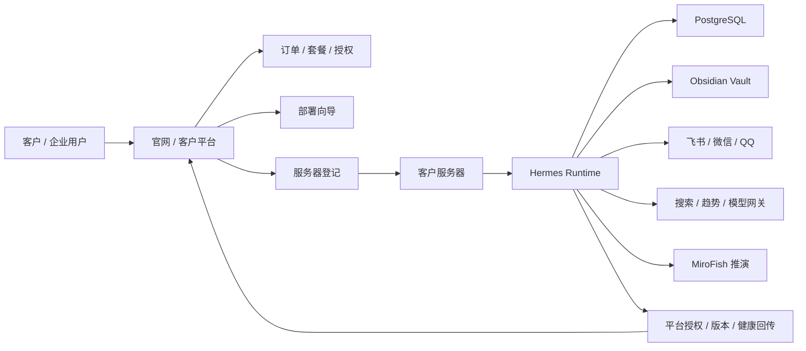

# Commercial Delivery Development Plan

本文档定义 MOXI Industrial Agent OS 面向客户售卖、服务器部署、网站平台建设、交付验收与后续商业化迭代的完整开发方案。

本方案的核心前提：

- 我们不是简单整合外部项目，而是从源码开始打造自有商业产品。
- `hermes-` 仓库是 Agent OS 的产品内核与客户侧运行系统。
- 另一个 GitHub 项目定位为服务器管理、官网、客户平台、购买交付、许可证和运维控制台。
- PostgreSQL 是生产数据库。
- Obsidian 是客户可读、可迁移、可审计的长期记忆和知识库，不是事务数据库。
- 所有客户可见能力都必须经过部署、权限、审计、备份、升级和售后闭环。

## 1. 商业产品定位

### 1.1 产品名称

建议商业名称：

- 对外品牌：MOXI Agent OS
- 工业版名称：MOXI Industrial Agent OS
- 后端内核：Hermes Runtime
- 客户控制台：MOXI Console
- 服务器平台：MOXI Cloud Platform

### 1.2 产品一句话定义

MOXI Industrial Agent OS 是一个可私有化部署、可接入企业工作流、可沉淀长期记忆、可执行受控任务、可对外售卖的工业级 AI Agent 操作系统。

它不是单个聊天机器人，而是一个包含后端调度、模型网关、工具执行、客户数据、长期记忆、审批管控、连接器、部署运维、商业授权和客户平台的完整产品。

### 1.3 目标客户

第一阶段目标客户：

- 中小企业主；
- 内容团队；
- 销售团队；
- 运营团队；
- 私域客户服务团队；
- 个人工作室；
- 需要私有知识库和自动化助手的高价值个人用户。

第二阶段目标客户：

- 多门店企业；
- 行业咨询公司；
- 研发团队；
- 财务、法务、行政等后台协同团队；
- 需要私有部署和审计的企业客户。

第三阶段目标客户：

- 行业解决方案代理商；
- SaaS 渠道商；
- 私有化交付集成商；
- 对数据隔离、审计和本地部署有强需求的组织。

### 1.4 客户购买的不是代码

客户真正购买的是：

- 一个可用的 AI 工作系统；
- 一套可部署的私有 Agent 环境；
- 一个可持续升级的商业产品；
- 一个能接入业务渠道的智能员工；
- 一套可审计、可备份、可恢复的知识和记忆系统；
- 一个有人维护、有版本、有售后、有升级路线的生产工具。

所以商业化开发不能只完成“功能能跑”，还必须完成：

- 安装；
- 初始化；
- 配置；
- 权限；
- 监控；
- 备份；
- 升级；
- 授权；
- 计费；
- 文档；
- 售后；
- 故障恢复；
- 数据迁移；
- 合规边界。

## 2. 双仓库总体分工

### 2.1 `hermes-` 仓库

`hermes-` 是客户侧 Agent OS 的源码主仓库。

它负责：

- Hermes 后端运行时；
- Agent 编排；
- 模型网关；
- 工具调用；
- 任务队列；
- 审批流；
- PostgreSQL 数据模型；
- Obsidian 长期记忆写入；
- EverOS 记忆引擎适配；
- TrendRadar / SearXNG / 爬虫适配；
- MiroFish 推演适配；
- 飞书、微信、QQ 等连接器适配；
- 本地生产部署；
- 域名服务器生产部署；
- 客户侧健康检查；
- 客户侧备份恢复；
- 客户侧升级脚本。

这个仓库交付给客户时，应该可以在客户服务器上形成一个独立可运行系统。

### 2.2 服务器管理与网站平台仓库

另一个 GitHub 项目不应该混入 Hermes 内核。它应该独立成为商业平台仓库，建议命名：

- `moxi-cloud-platform`
- `moxi-server-platform`
- `moxi-commercial-console`

它负责：

- 官网；
- 产品介绍页；
- 文档站；
- 客户注册；
- 登录与组织管理；
- 套餐购买；
- 订单管理；
- 授权码和许可证；
- 客户服务器登记；
- 部署向导；
- 域名绑定引导；
- 服务器健康状态展示；
- 版本升级控制；
- 客户工单；
- 售后支持；
- 远程诊断包接收；
- 管理员后台；
- 商业数据报表。

这个仓库不是 Agent 内核，而是商业交付平台。

### 2.3 两个仓库的关系



### 2.4 边界原则

`hermes-` 仓库不能依赖商业平台官网才能运行。客户私有化部署后，即使平台短暂不可用，本地核心能力仍应可用。

服务器管理平台可以提供：

- 授权验证；
- 更新检查；
- 远程状态展示；
- 工单支持；
- 部署脚本生成；
- 客户配置托管。

但它不应该直接持有客户业务数据、客户 Obsidian 记忆、聊天内容、企业文件或第三方平台会话。

## 3. 商业交付形态

### 3.1 交付版本

建议规划四个版本：

| 版本 | 适用客户 | 部署方式 | 核心卖点 |
| --- | --- | --- | --- |
| Personal Local | 高价值个人用户 | 本地电脑 / NAS / 小主机 | 私人长期记忆、助手、资料整理 |
| Team Server | 小团队 | 单台云服务器 | 团队知识库、飞书接入、审批、报告 |
| Business Private | 企业客户 | 客户私有服务器 | 企业数据隔离、连接器、审计、备份 |
| Managed Enterprise | 高价值企业 | 我方托管或混合云 | 运维托管、SLA、定制开发 |

### 3.2 售卖对象

可以售卖三类东西：

1. 软件授权：按年授权客户使用私有部署版本。
2. 部署服务：帮助客户完成服务器搭建、域名解析、HTTPS、连接器配置。
3. 增值服务：行业 Agent、业务流程、连接器、数据迁移、定制开发、运维托管。

### 3.3 推荐首发套餐

MVP 商业首发不建议做太复杂。建议先做三个套餐：

| 套餐 | 目标 | 包含 |
| --- | --- | --- |
| Starter | 个人和小团队试用 | 单服务器、1 个管理员、基础聊天、Obsidian 记忆、基础部署 |
| Pro | 真实团队使用 | 飞书接入、任务报告、审批流、备份恢复、模型网关配置 |
| Business | 企业私有部署 | 多用户、审计、服务器监控、定制连接器、售后支持 |

### 3.4 商业授权方式

第一阶段使用离线友好的许可证文件：

- 客户购买后平台生成 license；
- license 绑定客户 ID、组织 ID、版本、到期时间、授权能力；
- 客户部署时导入 license；
- Hermes 本地读取 license；
- 周期性联网时可检查更新，但不能因为短暂断网导致系统不可用。

第二阶段增加在线授权：

- 平台保存授权状态；
- Hermes 定期回传匿名健康状态；
- 平台可提示到期、升级、续费；
- 企业私有部署可使用离线 license。

### 3.5 不建议首发做的内容

首发阶段先不要做：

- 完全多租户 SaaS；
- 客户业务数据云端集中存储；
- 自动扣费后立即自动开通复杂私有部署；
- 过多社交平台连接器；
- 未审计的远程代码执行；
- 未经客户确认的自动发消息、自动付款、自动改配置。

## 4. 技术总体架构

### 4.1 客户侧架构

客户侧运行在本地或客户服务器上。

组件：

- Nginx：HTTPS、反向代理、静态资源；
- Hermes API：核心后端；
- Worker：异步任务、连接器轮询、报告生成；
- PostgreSQL：生产数据库；
- Obsidian Vault：长期记忆和报告；
- Redis：可选，用于队列和缓存；
- Vector Store：第二阶段引入，可先用 PostgreSQL pgvector；
- Connector Runtimes：飞书、微信、QQ 等；
- Backup Job：数据库和 Obsidian 备份；
- Health Agent：健康检查和平台回传。

### 4.2 平台侧架构

商业平台运行在我方服务器上。

组件：

- 官网前端；
- 客户控制台；
- 管理员后台；
- 订单和套餐系统；
- license 服务；
- 服务器登记服务；
- 部署向导；
- 版本发布服务；
- 工单系统；
- 文档站；
- 诊断包上传服务；
- 平台数据库；
- 对象存储。

### 4.3 数据归属

| 数据类型 | 存放位置 | 是否上传平台 |
| --- | --- | --- |
| 客户聊天内容 | 客户侧 PostgreSQL / Obsidian | 默认不上传 |
| 企业文件 | 客户侧 | 默认不上传 |
| 长期记忆 | 客户侧 Obsidian | 默认不上传 |
| 审计日志 | 客户侧 PostgreSQL | 默认不上传 |
| license 信息 | 平台侧和客户侧 | 可同步 |
| 服务器健康状态 | 平台侧摘要 | 可上传 |
| 版本号 | 平台侧和客户侧 | 可同步 |
| 错误诊断包 | 客户授权后上传 | 手动上传 |
| 订单数据 | 平台侧 | 必须保存 |

### 4.4 推荐技术栈

Hermes 客户侧：

- Python 3.12；
- FastAPI 或当前 Hermes HTTP 运行时继续演进；
- PostgreSQL 16；
- SQLAlchemy / Alembic；
- Pydantic；
- Docker Compose；
- Nginx；
- systemd；
- PowerShell 和 Bash 双平台部署脚本；
- pytest / unittest；
- GitHub Actions；
- pgvector 第二阶段引入。

MOXI / Brain UI：

- Next.js 或 Vite + React；
- TypeScript；
- Tailwind CSS；
- shadcn/ui 或同等级组件系统；
- TanStack Query；
- Zod；
- Playwright；
- WebSocket / SSE 用于任务进度。

商业平台仓库：

- Next.js；
- TypeScript；
- PostgreSQL；
- Prisma 或 Drizzle；
- Auth.js / Lucia / 自研企业登录；
- Stripe 或国内支付适配层；
- 对象存储；
- Redis；
- BullMQ / pg-boss；
- Docker；
- GitHub Actions；
- Sentry 或自建错误收集；
- Uptime Kuma / Prometheus / Grafana。

## 5. 核心模块开发清单

### 5.1 Hermes 后端内核

必须完成：

- 健康检查：`/health`、`/ready`、`/version`；
- 配置加载：环境变量、`.env`、客户配置；
- 模型网关：OpenAI-compatible、供应商切换、限额；
- 任务系统：创建任务、状态流转、事件记录；
- 审批系统：高风险动作必须审批；
- 工具注册：工具能力、权限、参数 schema；
- 连接器抽象：飞书、微信、QQ 不直接污染业务逻辑；
- 记忆候选：对话和报告生成候选记忆；
- Obsidian 写入：结构化 Markdown 输出；
- PostgreSQL 持久化：客户生产状态；
- 审计日志：谁在什么时候请求了什么、系统做了什么；
- 错误边界：失败要可见、可恢复、可诊断。

验收标准：

- 一条聊天请求可创建任务、调用模型、返回结果、写入审计；
- 一条高风险请求会进入审批，不会直接执行；
- 断开外部模型时系统返回可理解错误；
- `/ready` 能准确反映数据库、配置、关键服务状态。

### 5.2 PostgreSQL 数据层

必须完成：

- 数据库迁移系统；
- 用户表；
- 组织表；
- 角色表；
- 渠道绑定表；
- 任务表；
- 任务事件表；
- 审批表；
- 审计日志表；
- 模型调用记录表；
- 工具调用记录表；
- 记忆候选表；
- 报告元数据表；
- 连接器状态表；
- license 状态表；
- 系统设置表。

验收标准：

- 新环境可一键创建数据库；
- 迁移可重复执行；
- 升级不会丢失客户数据；
- 所有高风险行为都能追溯；
- 备份恢复后服务可启动。

### 5.3 Obsidian 长期记忆

必须完成：

- Vault 路径配置；
- 每个客户独立 Vault；
- 记忆候选到 Markdown 的晋升流程；
- 项目事实；
- 客户事实；
- 决策记录；
- 每日报告；
- 研究报告；
- 推演报告；
- 事故复盘；
- 人工编辑后的重新索引。

目录建议：

```text
ObsidianVault/
  00_System/
  01_Owner/
  02_Company/
  03_Customers/
  04_Projects/
  05_Reports/
  06_Research/
  07_Simulations/
  08_Decisions/
  09_Postmortems/
```

验收标准：

- 客户可以直接打开 Obsidian 阅读系统沉淀内容；
- 系统不会把未经确认的猜测写成事实；
- 每条长期记忆能追溯来源；
- 客户可以迁移 Vault，不被锁死。

### 5.4 EverOS 记忆引擎适配

EverOS 的定位是自动记忆提取和检索引擎，不是最终真相库。

必须完成：

- Hermes 到 EverOS 的适配层；
- 对话片段提取；
- 事实候选提取；
- 用户偏好候选；
- Agent 技能记忆候选；
- 语义检索；
- 检索结果可信度标记；
- 写入 Obsidian 前的人工或规则审核。

验收标准：

- EverOS 输出不会直接覆盖 Obsidian；
- 检索结果能显示来源；
- 低置信度内容不会被当成事实；
- 可以替换 EverOS，不影响 Hermes 主流程。

### 5.5 模型网关

必须完成：

- OpenAI-compatible API 支持；
- 多供应商配置；
- 模型能力标记；
- 文本、图片、语音、工具调用能力分层；
- 调用超时；
- 重试；
- 成本记录；
- token 用量记录；
- 客户级限额；
- 敏感任务模型白名单。

验收标准：

- 客户能配置自己的 API Key；
- 不同任务可路由到不同模型；
- 模型失败不会拖垮整个系统；
- 调用成本可查。

### 5.6 连接器

第一阶段只做稳定薄连接器：

- 飞书：企业通知、审批卡片、日报、任务摘要；
- 微信：个人提醒、轻量对话；
- QQ：个人或社群低风险互动。

原则：

- 连接器只负责收消息和发消息；
- 业务逻辑必须回到 Hermes；
- 每个渠道有独立权限；
- 不允许 QQ 或微信默认执行公司写操作；
- 涉及公司、财务、法律、人事、删除、外发承诺必须审批。

验收标准：

- 连接器断开时 Hermes 仍可运行；
- 渠道权限隔离；
- 消息来源可审计；
- 重复消息有幂等处理。

### 5.7 MOXI / Brain UI

必须完成：

- 登录；
- 首页状态；
- 聊天；
- 任务进度；
- 任务历史；
- 审批中心；
- 记忆候选；
- Obsidian 写入记录；
- 连接器设置；
- 模型设置；
- 服务器状态；
- license 状态；
- 备份恢复；
- 错误日志摘要；
- 管理员设置。

商业体验重点：

- 客户打开后知道系统是否可用；
- 模型、数据库、连接器、记忆、备份状态一眼可见；
- 长任务必须有进度；
- 危险动作必须明确等待审批；
- 不能让客户感觉是开发者 demo。

验收标准：

- 非技术客户可以完成初始化；
- 管理员能看到系统状态；
- 客户知道下一步该做什么；
- 错误信息可行动，不是堆栈噪音。

### 5.8 商业平台官网

必须完成：

- 产品首页；
- 套餐页；
- 部署方式说明；
- 安全与私有化说明；
- 文档入口；
- 登录注册；
- 客户控制台入口；
- 联系销售；
- 工单入口；
- 下载部署脚本或复制部署命令。

首页重点：

- 第一屏说清产品是什么；
- 展示私有化部署价值；
- 展示企业工作流、长期记忆、审批、连接器；
- 不要做空泛 AI 概念营销；
- 要让客户相信这是可部署的生产系统。

### 5.9 商业平台客户控制台

必须完成：

- 组织管理；
- 套餐状态；
- 订单；
- license 下载；
- 服务器登记；
- 部署向导；
- 域名配置指引；
- 健康状态；
- 版本更新；
- 工单；
- 诊断包上传；
- 发票和合同信息。

验收标准：

- 客户购买后能拿到部署所需信息；
- 客户能看到自己的授权和服务器；
- 客户能提交问题；
- 我方能定位客户使用的版本和部署模式。

### 5.10 管理员后台

必须完成：

- 客户列表；
- 组织列表；
- 订单列表；
- license 管理；
- 套餐管理；
- 服务器健康概览；
- 工单管理；
- 版本发布；
- 公告；
- 客户部署状态；
- 风险客户标记；
- 售后备注。

验收标准：

- 我方可以知道哪些客户已部署；
- 可以生成或吊销 license；
- 可以发布新版本；
- 可以追踪售后问题。

## 6. 一键部署到可用阶段

### 6.1 客户侧目标

客户拿到仓库或安装包后，应该能做到：

```bash
git clone <customer-repo-or-release>
cd hermes-
cp .env.example .env
./scripts/deploy-usable.sh
```

Windows 本地生产：

```powershell
.\scripts\deploy-usable.ps1
```

部署完成后输出：

- Hermes API 地址；
- Brain UI 地址；
- 健康检查地址；
- PostgreSQL 状态；
- Obsidian Vault 路径；
- 管理员初始化提示；
- 下一步连接器配置提示。

### 6.2 平台侧部署向导

客户平台应该提供：

- 操作系统选择；
- 本地部署或域名服务器部署选择；
- 域名解析教程；
- 防火墙端口检查；
- 自动生成 `.env` 模板；
- license 下载；
- Docker Compose 命令；
- Nginx 配置片段；
- HTTPS 证书引导；
- 部署完成后的健康检查。

### 6.3 部署方式

第一阶段支持：

- 本地生产：电脑、NAS、小主机、内网服务器；
- 单服务器生产：Linux VPS、云服务器、独立服务器；
- 域名生产：Nginx + HTTPS + DNS。

第二阶段支持：

- 远程托管；
- 多实例；
- 自动升级；
- 高可用；
- 客户数据迁移。

### 6.4 可用阶段定义

“部署到可用阶段”不是服务启动就结束。必须满足：

- 数据库可连接；
- 迁移已执行；
- API 健康；
- 管理员可登录；
- 模型网关可配置；
- 能完成一次聊天；
- 能创建一条任务；
- 能写入一条审计；
- 能写入一条 Obsidian 报告；
- 能执行一次备份；
- 能看到当前版本；
- 能导出诊断信息。

## 7. 研发阶段规划

### 7.1 Phase 0：仓库和产品基线

目标：

- 清理旧文档；
- 明确自研源码边界；
- 明确双仓库分工；
- 建立产品总方案；
- 建立部署脚本基线；
- 确定 PostgreSQL；
- 确定商业交付标准。

交付物：

- 当前文档体系；
- 一键部署草案；
- GitHub 仓库清理；
- 技术路线；
- 商业交互路线。

验收：

- 仓库不再像外部拼接项目；
- README 指向当前产品方向；
- 旧说明文档删除，只保留阶段报告；
- 后续开发任务可从文档拆分。

### 7.2 Phase 1：客户侧最小可售卖内核

目标：

- Hermes 可作为客户侧后端运行；
- PostgreSQL 真正接管生产状态；
- 基础 Brain UI 可用；
- 模型网关可配置；
- Obsidian 可写入；
- license 可读取；
- 一键部署可完成初始化。

交付物：

- Hermes API；
- 数据库迁移；
- 管理员账号初始化；
- 基础 UI；
- 模型配置；
- Obsidian 写入；
- license 文件校验；
- 部署脚本；
- 备份脚本。

验收：

- 单台服务器可部署；
- 管理员可登录；
- 可完成一次聊天；
- 可生成一份报告；
- 可写入 Obsidian；
- 可查看任务和审计；
- 可备份恢复。

### 7.3 Phase 2：商业平台 MVP

目标：

- 官网上线；
- 客户可注册；
- 可创建组织；
- 可选择套餐；
- 可生成 license；
- 可查看部署向导；
- 可登记服务器；
- 管理员可查看客户和授权。

交付物：

- 官网；
- 客户控制台；
- 管理员后台；
- license 服务；
- 订单模型；
- 服务器登记；
- 部署向导；
- 文档站。

验收：

- 客户购买流程能人工辅助完成；
- 平台能生成 license；
- 客户能拿到部署命令；
- 管理员能看到客户服务器状态。

### 7.4 Phase 3：企业工作流能力

目标：

- 飞书企业连接器可用；
- 审批流可用；
- 日报和周报可用；
- 任务和客户摘要可用；
- 权限边界可用。

交付物：

- 飞书消息入口；
- 飞书审批卡片；
- 企业日报；
- 审批中心；
- 任务报告；
- 企业知识写入 Obsidian。

验收：

- 飞书内可触发查询；
- 高风险动作会进入审批；
- 日报可追溯来源；
- 客户能在 UI 查看报告和审批。

### 7.5 Phase 4：记忆和智能增强

目标：

- EverOS 适配；
- 记忆候选审核；
- 语义检索；
- TrendRadar / SearXNG 接入；
- 研究报告生成；
- MiroFish 推演报告。

交付物：

- 记忆候选中心；
- 记忆审核；
- 研究任务；
- 趋势分析；
- 推演任务；
- 来源管理。

验收：

- 系统能从对话和报告提取候选记忆；
- 客户能批准或拒绝；
- 研究报告有来源；
- 推演不执行动作，只给建议和风险。

### 7.6 Phase 5：商业化稳定版

目标：

- 完成客户交付闭环；
- 版本升级稳定；
- 售后诊断闭环；
- 安全和合规说明完整；
- 定价与合同流程稳定。

交付物：

- 安装包或 release；
- 升级脚本；
- 诊断包；
- 工单系统；
- SLA 文档；
- 客户部署手册；
- 管理员运维手册；
- 安全白皮书初版。

验收：

- 新客户可按流程完成部署；
- 售后能定位问题；
- 升级不会丢数据；
- 客户可以导出自己的数据；
- 商业交付可重复。

## 8. 项目管理和任务拆分

### 8.1 `hermes-` 仓库任务

优先级 P0：

- PostgreSQL 迁移；
- 配置系统；
- license 文件读取；
- 健康检查；
- 管理员初始化；
- 模型网关；
- 任务和审计；
- Obsidian 写入；
- 一键部署；
- 备份恢复。

优先级 P1：

- Brain UI；
- 审批中心；
- 飞书连接器；
- 记忆候选；
- 研究报告；
- 工具权限；
- 服务器诊断包。

优先级 P2：

- EverOS 深度适配；
- MiroFish 推演；
- SearXNG；
- 微信和 QQ；
- 多组织；
- 高级权限；
- pgvector。

### 8.2 商业平台仓库任务

优先级 P0：

- 官网；
- 登录注册；
- 组织；
- 套餐；
- license 生成；
- 部署向导；
- 管理员后台；
- 客户服务器登记。

优先级 P1：

- 订单；
- 支付；
- 工单；
- 文档站；
- 版本发布；
- 健康回传；
- 诊断包上传。

优先级 P2：

- 自动续费；
- 渠道商；
- 客户成功看板；
- 远程托管；
- 多区域部署；
- 自动升级编排。

## 9. 安全和合规边界

### 9.1 默认安全原则

- 客户业务数据默认留在客户侧；
- 平台不默认读取客户聊天内容；
- 平台不默认读取客户 Obsidian；
- 外部模型 API Key 由客户自己配置；
- 敏感动作必须审批；
- 所有管理操作写审计；
- license 不应包含客户密钥；
- 诊断包上传必须由客户主动触发；
- 日志脱敏后才能导出。

### 9.2 高风险动作

必须审批：

- 对外发送正式承诺；
- 删除客户资料；
- 修改系统配置；
- 连接器授权变更；
- 批量消息发送；
- 资金相关动作；
- 法务、人事、合同相关动作；
- 服务器升级和回滚；
- 生产数据库恢复。

### 9.3 商业合规文档

正式售卖前需要准备：

- 用户协议；
- 隐私政策；
- 数据处理说明；
- 私有化部署数据边界说明；
- 第三方模型使用说明；
- 开源许可证清单；
- 安全白皮书；
- SLA；
- 售后服务条款；
- 退款政策；
- 企业版合同模板。

## 10. 客户交付流程

### 10.1 标准交付流程

1. 客户咨询；
2. 确认部署方式；
3. 创建平台账号；
4. 选择套餐；
5. 生成 license；
6. 准备服务器；
7. 域名解析；
8. 运行部署脚本；
9. 初始化管理员；
10. 配置模型 API；
11. 配置 Obsidian Vault；
12. 配置连接器；
13. 完成健康检查；
14. 交付验收；
15. 进入售后支持。

### 10.2 客户验收清单

客户验收必须包括：

- 登录成功；
- 系统健康；
- 数据库正常；
- 模型调用成功；
- 聊天成功；
- 任务记录成功；
- 审计记录成功；
- Obsidian 写入成功；
- 备份成功；
- 恢复演练通过；
- license 状态正常；
- 连接器状态正常；
- 文档交付完成。

### 10.3 售后支持清单

售后支持需要客户提供：

- 版本号；
- 部署模式；
- 操作系统；
- 错误时间；
- 操作步骤；
- 脱敏日志；
- 诊断包；
- 是否修改过配置；
- 是否升级过系统。

平台侧应该自动保存：

- 客户组织；
- license；
- 服务器 ID；
- 版本号；
- 最近健康时间；
- 工单历史。

## 11. 版本发布策略

### 11.1 版本号

建议采用：

```text
MAJOR.MINOR.PATCH
```

示例：

- `0.1.0`：内部可运行；
- `0.2.0`：首个客户试点；
- `0.5.0`：商业 Beta；
- `1.0.0`：正式可售卖版本。

### 11.2 发布类型

| 类型 | 含义 |
| --- | --- |
| dev | 开发版本 |
| alpha | 内部测试 |
| beta | 客户试点 |
| stable | 稳定商用 |
| lts | 长期支持 |

### 11.3 发布内容

每个 release 必须包含：

- 版本说明；
- 升级说明；
- 数据库迁移说明；
- 兼容性说明；
- 已知问题；
- 回滚方式；
- 校验命令；
- 安全更新说明。

## 12. 收入模型

### 12.1 软件授权

按年收费：

- Starter：个人或小团队；
- Pro：团队生产使用；
- Business：企业私有化；
- Enterprise：定制合同。

### 12.2 部署服务

一次性收费：

- 本地部署；
- 云服务器部署；
- 域名和 HTTPS；
- 飞书接入；
- 企业知识库初始化；
- 数据迁移。

### 12.3 运维服务

按月或按年收费：

- 监控；
- 备份检查；
- 版本升级；
- 故障响应；
- 安全巡检；
- 模型成本优化。

### 12.4 定制开发

按项目收费：

- 行业 Agent；
- 专用连接器；
- 报表模板；
- 私有模型接入；
- ERP / CRM / OA 对接；
- 权限和审批定制。

## 13. 最小商业试点方案

### 13.1 试点目标

在不做完整 SaaS 的情况下，完成第一批真实客户交付。

### 13.2 试点范围

包含：

- 单服务器部署；
- PostgreSQL；
- Hermes；
- 基础 Brain UI；
- 模型网关；
- Obsidian；
- license；
- 飞书通知；
- 备份；
- 健康检查；
- 工单支持。

不包含：

- 完全多租户；
- 自动支付闭环；
- 复杂微信生态；
- 大规模自动运维；
- 客户数据云端托管。

### 13.3 试点成功标准

- 至少 3 个真实客户部署；
- 每个客户连续运行 14 天；
- 至少完成 20 次有效任务；
- 至少生成 5 份有效报告；
- 至少完成 1 次备份恢复演练；
- 客户知道如何查看系统状态；
- 售后能通过诊断包定位问题。

## 14. 风险和应对

### 14.1 技术风险

| 风险 | 应对 |
| --- | --- |
| 部署复杂 | 一键脚本、部署向导、健康检查 |
| 外部模型不稳定 | 多模型供应商、超时、重试、降级 |
| 连接器易变 | 连接器薄适配、能力状态展示 |
| 记忆污染 | 候选审核、来源追溯、人工晋升 |
| 数据丢失 | 自动备份、恢复演练、迁移测试 |
| 升级失败 | 版本锁定、回滚脚本、迁移前备份 |

### 14.2 商业风险

| 风险 | 应对 |
| --- | --- |
| 客户以为是普通聊天机器人 | 官网和演示突出工作流、记忆、私有部署 |
| 客户不会部署 | 提供部署服务和平台向导 |
| 售后成本高 | 诊断包、标准化日志、明确支持范围 |
| 定制需求过多 | 套餐边界、插件合同、二次开发报价 |
| 数据责任不清 | 私有化边界、隐私政策、客户自持密钥 |

### 14.3 合规风险

| 风险 | 应对 |
| --- | --- |
| 误传客户数据 | 默认本地存储、手动诊断包上传 |
| 第三方模型数据边界不清 | 模型供应商说明、客户自配 API Key |
| 自动执行敏感动作 | 审批系统和风险分类 |
| 开源许可证问题 | 依赖清单和许可证审计 |

## 15. 最终交付定义

一个客户可交付版本必须同时满足：

- 源码边界清楚；
- 部署命令清楚；
- 数据库可迁移；
- 服务可健康检查；
- UI 可操作；
- 模型可配置；
- 记忆可审查；
- 报告可沉淀；
- 连接器可关闭；
- 审批可追溯；
- license 可验证；
- 备份可恢复；
- 升级有路径；
- 故障可诊断；
- 文档可读；
- 商业平台能管理客户、授权、服务器和工单。

## 16. 下一步执行建议

下一步不要继续横向扩功能，应按商业交付闭环推进。

第一优先级：

1. 在 `hermes-` 中完成 PostgreSQL 迁移和生产数据模型。
2. 在 `hermes-` 中完成 license 文件读取和授权能力开关。
3. 在 `hermes-` 中完成管理员初始化和基础 UI 合同。
4. 在 `hermes-` 中完成 Obsidian 报告写入和备份恢复。
5. 在商业平台仓库中搭建官网、登录、客户组织、license 生成和部署向导。

第二优先级：

1. 飞书连接器。
2. 审批中心。
3. 服务器健康回传。
4. 诊断包。
5. 工单系统。

第三优先级：

1. EverOS 深度记忆。
2. TrendRadar / SearXNG 情报。
3. MiroFish 推演。
4. 微信和 QQ。
5. 企业版高级权限。

本方案应作为两个仓库共同开发的总控蓝图：`hermes-` 负责客户服务器上的 Agent OS，另一个 GitHub 项目负责把它卖出去、交付出去、管起来、续费起来。
