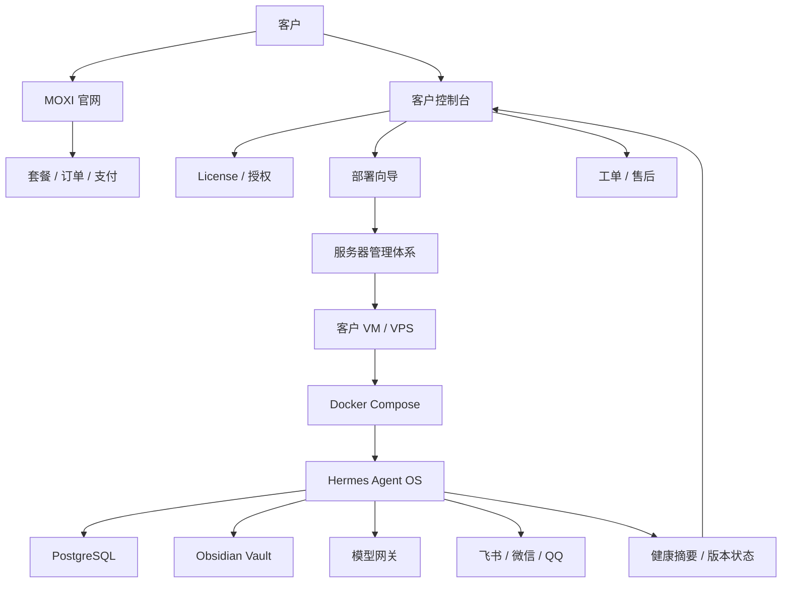

# Three-Pillar Commercial Project Plan

本文档定义 MOXI 商业项目的三维总体方案：

- Hermes 产品内核；
- MOXI-cloud-agent 网站与商业平台；
- 服务器管理与客户部署体系。

当前决策：

- `hermes-` 是客户侧 Agent OS 产品内核仓库。
- `github.com/LUTAO581314/MOXI-cloud-agent` 是网站平台与服务器管理仓库。
- 两个仓库都可以按当前方案推倒重建，不继承旧项目的错误边界。
- 商业目标不是展示 Demo，而是对客户售卖可部署、可验收、可续费、可维护的 Agent 产品。

## 1. 总体商业架构

### 1.1 三个维度

| 维度 | 仓库 / 系统 | 核心职责 | 客户是否直接使用 |
| --- | --- | --- | --- |
| Agent 产品内核 | `hermes-` | AI Agent、任务、模型、记忆、连接器、客户侧运行时 | 是 |
| 网站与商业平台 | `MOXI-cloud-agent` | 官网、购买、客户后台、授权、工单、部署向导 | 是 |
| 服务器管理体系 | `MOXI-cloud-agent` + 运维脚本 | VM、Docker、资源、健康、备份、升级、监控 | 间接使用 |

### 1.2 三维关系



### 1.3 商业系统边界

Hermes 不能变成网站平台的一部分。Hermes 是客户真正部署和使用的 Agent 产品。

MOXI-cloud-agent 不能变成 Agent 内核。它是销售、交付、服务器管理和售后平台。

服务器管理不能只靠文档。它必须形成脚本、状态、监控、备份、升级和诊断能力。

## 2. 产品一：Hermes Agent OS

### 2.1 产品定位

Hermes 是客户侧运行的 Agent OS 内核，负责把 AI 从聊天框变成可控生产系统。

它需要提供：

- 多模型调用；
- 任务编排；
- 工具执行；
- 审批管控；
- 企业连接器；
- 长期记忆；
- 报告沉淀；
- 审计追踪；
- 备份恢复；
- 本地或服务器生产部署。

### 2.2 Hermes 不负责什么

Hermes 不负责：

- 官网营销；
- 套餐售卖；
- 支付；
- 发票；
- 客户工单；
- 多客户服务器调度；
- 平台级账号体系；
- 代理商管理；
- 公共 SaaS 门户。

这些属于 MOXI-cloud-agent。

### 2.3 Hermes 核心模块

| 模块 | 功能 | MVP 要求 |
| --- | --- | --- |
| Runtime API | HTTP API、健康检查、版本信息 | 必须 |
| Auth | 管理员登录、客户本地账号 | 必须 |
| Config | `.env`、系统设置、模型配置 | 必须 |
| License | 本地授权文件、能力开关、到期提醒 | 必须 |
| Model Gateway | OpenAI-compatible、多供应商、成本记录 | 必须 |
| Job System | 异步任务、进度、事件、失败恢复 | 必须 |
| Approval | 敏感动作审批 | 必须 |
| Tool Registry | 工具注册、权限、参数 schema | 必须 |
| PostgreSQL | 生产状态、审计、任务、配置 | 必须 |
| Obsidian | 长期记忆、报告、决策记录 | 必须 |
| Connector Layer | 飞书、微信、QQ 适配边界 | P1 |
| Intelligence | 搜索、趋势、来源报告 | P1 |
| Simulation | MiroFish 推演 | P2 |
| EverOS Memory | 自动记忆候选和检索 | P2 |

### 2.4 Hermes 数据设计

Hermes 使用 PostgreSQL 作为生产数据库。

最小表域：

- organizations；
- users；
- roles；
- sessions；
- licenses；
- system_settings；
- model_providers；
- model_calls；
- jobs；
- job_events；
- approvals；
- audit_logs；
- tool_calls；
- connector_accounts；
- connector_events；
- memory_candidates；
- obsidian_writes；
- reports；
- backup_runs；
- health_snapshots。

Obsidian 只保存客户可读的长期材料：

- 事实；
- 决策；
- 报告；
- 研究；
- 推演；
- 复盘；
- 客户资料摘要；
- 项目记录。

### 2.5 Hermes 交付形态

Hermes 应支持三种交付：

| 交付形态 | 适用场景 | 技术方式 |
| --- | --- | --- |
| 本地个人版 | 高价值个人用户、内网工作站 | Docker Compose 或 venv |
| 单客户服务器版 | 标准商业私有化 | VPS / VM + Docker Compose |
| 企业私有化版 | 更高安全要求客户 | 独立服务器 / 专有 VM + Docker Compose |

生产默认不使用裸 venv。venv 只用于开发、调试或高级客户手动模式。

### 2.6 Hermes 验收标准

Hermes 交付给客户时必须满足：

- 一键部署成功；
- 管理员初始化成功；
- PostgreSQL 迁移成功；
- `/health`、`/ready`、`/version` 正常；
- 模型配置成功；
- 能完成一次聊天；
- 能创建任务；
- 能展示任务进度；
- 能写审计日志；
- 能写入 Obsidian 报告；
- 能读取 license；
- 能执行备份；
- 能导出诊断包；
- 升级前可备份；
- 升级失败可回滚。

## 3. 产品二：MOXI-cloud-agent 网站与商业平台

### 3.1 平台定位

`MOXI-cloud-agent` 是商业入口和交付控制台。

它负责回答三个问题：

1. 客户为什么买？
2. 客户怎么买、怎么拿到授权、怎么部署？
3. 我们怎么管理客户、服务器、版本、工单和续费？

### 3.2 平台可以删除重建

如果当前 `MOXI-cloud-agent` 里面已有旧网站、旧 Demo、旧脚本、旧前端，可以按以下原则清理：

- 删除与当前商业方向无关的页面；
- 删除不能交付的假功能；
- 删除不清楚来源的外部拼接代码；
- 删除泄露部署细节但不能执行的旧文档；
- 保留可复用的视觉资产、品牌文字、可用组件；
- 以本方案为产品边界重新开发。

### 3.3 平台核心模块

| 模块 | 面向对象 | 作用 | 优先级 |
| --- | --- | --- | --- |
| 官网 | 潜在客户 | 产品介绍、转化、预约演示 | P0 |
| 文档站 | 客户 / 售后 | 部署、使用、FAQ、版本说明 | P0 |
| 登录注册 | 客户 | 平台身份入口 | P0 |
| 组织管理 | 客户 | 公司、成员、角色 | P0 |
| 套餐管理 | 客户 / 管理员 | Starter / Pro / Business | P0 |
| License 服务 | 客户 / Hermes | 生成、下载、校验授权 | P0 |
| 部署向导 | 客户 | 生成部署命令和 `.env` | P0 |
| 服务器登记 | 客户 / 运维 | 记录客户服务器实例 | P0 |
| 管理员后台 | 我方 | 客户、订单、授权、服务器 | P0 |
| 工单系统 | 客户 / 售后 | 问题处理闭环 | P1 |
| 版本发布 | 我方 / Hermes | release、升级提示、兼容性 | P1 |
| 健康回传 | 我方 / 客户 | 展示在线、版本、异常摘要 | P1 |
| 支付订单 | 客户 | 自动购买和续费 | P1 |
| 诊断包上传 | 客户 / 售后 | 故障定位 | P1 |
| 代理商系统 | 渠道 | 分销与客户管理 | P2 |

### 3.4 官网结构

官网第一版不做空泛营销页，要直接说明可交付能力。

页面：

- 首页；
- 产品能力；
- 私有化部署；
- 套餐价格；
- 安全与数据边界；
- 客户案例；
- 文档；
- 联系销售；
- 登录控制台。

首页第一屏应表达：

```text
MOXI Agent OS
可私有化部署的企业 AI Agent 操作系统
```

首页必须突出：

- 私有部署；
- 企业工作流；
- 长期记忆；
- 审批安全；
- 飞书 / 微信 / QQ 连接器；
- PostgreSQL + Obsidian 数据边界；
- 一键部署；
- 可售后运维。

### 3.5 客户控制台

客户登录后看到：

- 当前套餐；
- license 状态；
- 服务器列表；
- 部署向导；
- 版本信息；
- 工单；
- 文档入口；
- 支付或续费入口；
- 安全说明；
- 诊断包上传入口。

客户创建新服务器时：

1. 选择部署类型；
2. 填写服务器名称；
3. 选择系统；
4. 选择是否已有域名；
5. 下载 license；
6. 生成部署命令；
7. 完成后回填健康检查地址；
8. 平台展示服务器状态。

### 3.6 管理员后台

我方管理员需要看到：

- 客户列表；
- 组织列表；
- 套餐状态；
- 订单；
- license；
- 服务器；
- 健康状态；
- 当前版本；
- 工单；
- 售后备注；
- 风险客户；
- 版本发布；
- 公告；
- 诊断包。

管理员必须能：

- 创建 license；
- 吊销 license；
- 延长到期时间；
- 变更能力开关；
- 标记客户状态；
- 查看服务器最后心跳；
- 创建版本发布记录；
- 处理工单。

### 3.7 平台技术栈建议

建议 `MOXI-cloud-agent` 重建为：

- Next.js；
- TypeScript；
- PostgreSQL；
- Prisma 或 Drizzle；
- Tailwind CSS；
- shadcn/ui；
- Auth.js 或 Lucia；
- Redis 可选；
- S3-compatible 对象存储；
- Docker Compose；
- GitHub Actions；
- Playwright；
- Stripe 和国内支付适配层预留。

首阶段可以先不接真实支付，用人工收款 + 平台生成 license 的半自动模式，更快完成试点。

### 3.8 平台数据库模型

平台侧 PostgreSQL 最小表域：

- platform_users；
- organizations；
- organization_members；
- plans；
- subscriptions；
- orders；
- invoices；
- licenses；
- license_features；
- customer_servers；
- server_heartbeats；
- deployments；
- release_channels；
- releases；
- support_tickets；
- ticket_messages；
- diagnostic_uploads；
- audit_logs。

平台不能保存客户业务聊天内容，除非客户明确开启托管模式并签署数据处理协议。

## 4. 产品三：服务器管理体系

### 4.1 服务器管理定位

服务器管理不是单纯“买一台服务器跑几个进程”。它是商业交付能力的一部分。

它要负责：

- 创建客户环境；
- 分配资源；
- 隔离客户；
- 安装 Hermes；
- 管理域名和 HTTPS；
- 健康检查；
- 备份恢复；
- 升级回滚；
- 监控告警；
- 诊断支持；
- 成本控制。

### 4.2 隔离策略

正式商业环境隔离强度：

| 等级 | 方式 | 适用场景 | 是否推荐售卖 |
| --- | --- | --- | --- |
| L0 | venv 多实例 | 开发、临时测试 | 否 |
| L1 | 同机多 Docker Compose | 内测、演示、低价试点 | 谨慎 |
| L2 | 单机多 VM，VM 内 Docker | 我方托管多个小客户 | 是 |
| L3 | 每客户独立 VPS / VM | 标准私有化交付 | 是 |
| L4 | 每客户独立物理机 | 高安全企业 | 是 |

### 4.3 为什么不用磁盘分区当隔离

磁盘分区只能隔离存储路径，不能隔离：

- CPU；
- 内存；
- 进程；
- 网络；
- 系统权限；
- 内核；
- 数据库连接；
- 文件句柄；
- IO 抢占；
- 客户越权风险。

所以磁盘分区可以作为数据管理手段，但不是客户隔离手段。

商业服务器管理要学云厂商，使用 VM / VPS / 容器资源限制 / 监控 / 配额 / 快照 / 备份。

### 4.4 推荐服务器套餐

客户套餐和服务器资源不要一开始过度承诺。

| 商业套餐 | 推荐资源 | 适用 |
| --- | --- | --- |
| Starter | 2c4g | 个人、小团队轻量使用 |
| Pro | 4c8g | 企业日常使用、飞书、报告 |
| Business | 8c16g | 多用户、更多任务、私有化 |
| Enterprise | 定制 | 高并发、专有模型、多连接器 |

2c2g 只适合测试或极轻量客户，不建议作为正式售卖主套餐。

### 4.5 16c16g 服务器切分建议

如果主人有一台 16c16g 服务器：

内部测试可以：

- 7 个 2c2g VM；
- 2c2g 给宿主机。

商业试点建议：

- 3 到 4 个客户 VM；
- 每个 2c3g 或 2c4g；
- 宿主机至少保留 2c4g；
- 预留磁盘和备份空间；
- PostgreSQL 尽量放在客户 VM 内，避免多客户共用一个数据库实例。

正式售卖建议：

- 一个客户一个 VPS / VM；
- 企业客户独立服务器；
- 我方托管时再考虑多 VM 共宿主机。

### 4.6 客户 VM 内部结构

每个客户 VM 内运行：

```text
customer-vm
  nginx
  hermes-api
  hermes-worker
  postgres
  redis optional
  obsidian-vault
  backup-job
  health-agent
```

默认使用 Docker Compose。

不建议在同一个 VM 里混多个正式客户。

### 4.7 宿主机管理

宿主机只做管理，不跑客户业务逻辑。

宿主机负责：

- VM 创建；
- CPU / 内存限制；
- 虚拟磁盘；
- 网络桥接；
- 防火墙；
- 快照；
- 备份；
- 监控 agent；
- 日志采集；
- 告警；
- 远程维护入口。

宿主机必须禁止客户登录。

### 4.8 服务器管理功能

`MOXI-cloud-agent` 应逐步提供服务器管理能力。

P0 手动辅助：

- 服务器登记；
- 部署命令生成；
- license 下载；
- 健康检查地址登记；
- 手动标记部署状态；
- 售后备注。

P1 半自动：

- 心跳上报；
- 版本检测；
- 备份状态；
- 磁盘使用率；
- CPU / 内存摘要；
- 错误摘要；
- 诊断包上传。

P2 自动化：

- 自动创建 VM；
- 自动下发部署；
- 自动配置 Nginx；
- 自动签发 HTTPS；
- 自动升级；
- 自动回滚；
- 多客户资源看板。

P3 托管云：

- 客户在线开通；
- 自动计费；
- 自动扩容；
- 多区域部署；
- SLA 告警；
- 运维值班。

### 4.9 健康回传

Hermes 客户侧只回传必要摘要，不上传业务数据。

可回传：

- server_id；
- organization_id；
- license_id；
- hermes_version；
- deployment_mode；
- last_seen_at；
- health_status；
- database_status；
- backup_status；
- disk_usage_percent；
- memory_usage_percent；
- connector_status_summary；
- error_count_24h。

不回传：

- 聊天内容；
- Obsidian 正文；
- 客户文件；
- 模型 API Key；
- 第三方平台 token；
- 审批具体内容；
- 企业内部资料。

## 5. 三维开发路线

### 5.1 Phase 0：重建基线

Hermes：

- 保持当前文档基线；
- 明确 PostgreSQL；
- 明确 Obsidian；
- 明确 Docker Compose 生产部署；
- 建立 license 和部署要求。

MOXI-cloud-agent：

- 允许删除旧代码；
- 新建 Next.js 项目；
- 建立官网、登录、客户控制台、管理员后台骨架；
- 建立平台数据库 schema；
- 建立 license 数据模型。

服务器管理：

- 定义部署模式；
- 定义服务器登记模型；
- 定义健康回传协议；
- 定义 16c16g 试点切分策略；
- 定义客户 VM 模板。

验收：

- 两个仓库 README 都能说明各自职责；
- 方案文档不冲突；
- 旧项目边界清理完成。

### 5.2 Phase 1：首个可售卖试点

Hermes：

- PostgreSQL 迁移；
- 管理员初始化；
- 模型网关；
- Job；
- Audit；
- Obsidian 写入；
- 本地 license；
- 备份恢复；
- Docker Compose 部署。

MOXI-cloud-agent：

- 官网；
- 注册登录；
- 组织；
- 套餐；
- license 生成；
- 部署向导；
- 服务器登记；
- 管理员后台。

服务器管理：

- 手动创建客户 VPS / VM；
- 客户 VM 内 Docker Compose；
- 平台登记 server_id；
- Hermes 上报心跳；
- 售后诊断包。

验收：

- 可以卖给第一个试点客户；
- 客户能拿到 license；
- 客户能按向导部署；
- 平台能看到服务器在线；
- Hermes 能正常执行基础任务。

### 5.3 Phase 2：标准商业版

Hermes：

- Brain UI 完整；
- 审批中心；
- 飞书连接器；
- 记忆候选；
- 模型成本统计；
- 连接器状态；
- 升级脚本。

MOXI-cloud-agent：

- 订单；
- 支付；
- 工单；
- 文档站；
- 版本发布；
- 诊断包上传；
- 客户续费。

服务器管理：

- 自动健康检查；
- 备份状态回传；
- 版本升级提示；
- Nginx 和 HTTPS 标准模板；
- VM 快照流程。

验收：

- 能连续交付多个客户；
- 售后问题可定位；
- 升级前后数据不丢；
- 客户能续费。

### 5.4 Phase 3：托管和规模化

Hermes：

- 多组织；
- 更细权限；
- EverOS；
- TrendRadar；
- MiroFish；
- 微信 / QQ；
- 行业插件。

MOXI-cloud-agent：

- 自动开通；
- 渠道商；
- 客户成功看板；
- 发票合同；
- SLA；
- 托管服务入口。

服务器管理：

- 自动 VM 创建；
- 自动部署；
- 自动扩容；
- 自动回滚；
- 多宿主机；
- 成本统计；
- 资源配额。

验收：

- 可以支撑批量客户；
- 运维不依赖纯手工；
- 可以卖托管版和企业版。

## 6. 双仓库重建建议

### 6.1 `hermes-` 保留并继续演进

`hermes-` 当前已经完成产品方向清理，不建议再整库删除。

下一步应该进入代码实现：

1. PostgreSQL 迁移；
2. license 文件；
3. 管理员初始化；
4. 模型网关；
5. Obsidian 写入；
6. 备份恢复；
7. Docker Compose 生产可用。

### 6.2 `MOXI-cloud-agent` 可以重建

如果 `MOXI-cloud-agent` 是旧项目，建议：

1. 备份当前 main；
2. 新建 `archive/` 或打 tag；
3. 删除旧应用代码；
4. 保留 `.git` 和必要配置；
5. 重新初始化 Next.js；
6. 写入本方案对应 README；
7. 建立 `docs/`；
8. 建立数据库 schema；
9. 建立官网和控制台骨架。

如果要彻底重新开始，也可以：

1. 创建新 orphan 分支；
2. 用新源码作为 root commit；
3. 强制替换远端 main。

但强制替换历史只建议在确认没有其他协作者依赖旧历史后执行。

### 6.3 平台仓库建议目录

```text
MOXI-cloud-agent/
  apps/
    web/
      app/
      components/
      lib/
  packages/
    db/
    license/
    server-agent-protocol/
    ui/
  infra/
    docker/
    nginx/
    scripts/
  docs/
    00-platform-product-plan.md
    01-server-management-plan.md
    02-license-and-billing.md
    03-deployment-wizard.md
    04-admin-console.md
    05-customer-console.md
  prisma/
  docker-compose.yml
  README.md
```

### 6.4 平台仓库首批文档

`MOXI-cloud-agent` 首批必须有：

- 平台产品方案；
- 服务器管理方案；
- license 方案；
- 客户控制台方案；
- 管理员后台方案；
- 部署向导方案；
- 数据边界说明；
- 和 Hermes 的接口协议。

## 7. Hermes 与平台接口

### 7.1 License 文件

平台生成 license，Hermes 本地读取。

license 字段：

- license_id；
- organization_id；
- plan；
- issued_at；
- expires_at；
- features；
- max_users；
- max_connectors；
- max_jobs_per_day；
- deployment_mode；
- signature。

Hermes 不依赖平台实时在线才能运行。

### 7.2 Server Registration

平台创建 server_id，客户部署时写入 `.env`。

Hermes 启动后上报：

- server_id；
- license_id；
- version；
- health；
- timestamp。

### 7.3 Release Check

Hermes 可定期请求平台：

- 当前稳定版本；
- 当前 LTS 版本；
- 是否有安全更新；
- 是否需要迁移；
- 升级说明 URL。

平台不能远程强制执行客户升级，除非客户明确开启托管模式。

### 7.4 Support Bundle

Hermes 生成脱敏诊断包。

诊断包内容：

- 版本；
- 配置摘要；
- 健康状态；
- 最近错误摘要；
- 数据库迁移状态；
- 备份状态；
- 连接器状态；
- 日志片段。

不包含：

- API Key；
- token；
- 聊天正文；
- Obsidian 正文；
- 客户文件。

## 8. 商业交付模式

### 8.1 私有化交付

客户自己有服务器。

流程：

1. 平台购买；
2. 生成 license；
3. 客户准备服务器；
4. 平台给部署向导；
5. 客户或我方运行部署；
6. Hermes 上报健康；
7. 完成验收。

### 8.2 我方代部署

客户不懂服务器。

流程：

1. 客户购买软件 + 部署服务；
2. 我方购买或接入服务器；
3. 我方创建 VM / VPS；
4. 部署 Hermes；
5. 绑定域名；
6. 配置 HTTPS；
7. 初始化模型和 Obsidian；
8. 交付账号。

### 8.3 托管版

我方长期负责运行。

额外要求：

- 运维 SLA；
- 自动备份；
- 监控告警；
- 月度巡检；
- 成本核算；
- 客户数据处理协议；
- 更严格权限。

## 9. 售卖套餐建议

### 9.1 Starter

目标：

- 个人；
- 工作室；
- 小团队试点。

包含：

- 单服务器；
- 1 到 3 用户；
- 基础聊天；
- Obsidian；
- 模型网关；
- 手动备份；
- 基础部署文档。

推荐资源：

- 2c4g。

### 9.2 Pro

目标：

- 小企业；
- 内容团队；
- 运营团队。

包含：

- 5 到 20 用户；
- 飞书通知；
- 审批；
- 报告；
- 备份恢复；
- 工单支持；
- 健康回传。

推荐资源：

- 4c8g。

### 9.3 Business

目标：

- 企业私有化。

包含：

- 多用户；
- 多连接器；
- 审计；
- 定制报告；
- 专属部署；
- 版本升级服务；
- 售后支持。

推荐资源：

- 8c16g 起。

### 9.4 Enterprise

目标：

- 高价值企业；
- 行业解决方案。

包含：

- 专属服务器；
- 高级权限；
- 行业 Agent；
- 定制连接器；
- 私有模型；
- SLA；
- 合同交付。

资源：

- 定制。

## 10. 最小可卖版本定义

最小可卖版本不是功能最多，而是交付闭环完整。

必须完成：

Hermes：

- 可部署；
- 可登录；
- 可配置模型；
- 可聊天；
- 可写报告；
- 可审计；
- 可备份；
- 可读取 license。

平台：

- 官网；
- 客户账号；
- license 生成；
- 部署向导；
- 服务器登记；
- 管理后台。

服务器管理：

- 推荐资源规格；
- 部署脚本；
- 健康检查；
- 备份方案；
- 诊断包；
- 手动运维流程。

试点成功标准：

- 3 个真实客户；
- 连续运行 14 天；
- 每客户完成至少 20 次有效任务；
- 每客户完成至少 1 次备份恢复演练；
- 售后问题能通过诊断包定位。

## 11. 当前最优执行顺序

第一步：稳定 Hermes 产品内核。

- PostgreSQL；
- license；
- 管理员初始化；
- 模型网关；
- Obsidian；
- 备份；
- Docker Compose。

第二步：重建 MOXI-cloud-agent 平台。

- Next.js 项目；
- 官网；
- 登录；
- 组织；
- license；
- 部署向导；
- 服务器登记；
- 管理后台。

第三步：做服务器管理最小闭环。

- 手动 VM / VPS；
- Docker Compose；
- Nginx；
- HTTPS；
- 健康回传；
- 诊断包；
- 备份恢复。

第四步：首批客户试点。

- 选择 3 个客户；
- 人工辅助部署；
- 收集问题；
- 完成迭代；
- 打磨售后和文档。

第五步：再做自动化。

- 支付；
- 自动开通；
- 自动 VM；
- 自动升级；
- 托管云；
- 渠道商。

## 12. 最终判断

主人当前这个项目应该按“三维产品”推进：

1. `hermes-` 是可交付的 Agent OS。
2. `MOXI-cloud-agent` 是官网、客户平台和商业控制台。
3. 服务器管理体系是交付、隔离、健康、备份、升级和售后的底座。

`MOXI-cloud-agent` 可以删除旧代码重建，但不能把 Hermes 内核塞进去。它应该负责把 Hermes 卖出去、部署出去、管起来、续费起来。

服务器管理不要依赖磁盘分区或 venv 多实例。正式路径应是：

```text
客户 / 套餐 -> 平台 license -> VPS / VM -> Docker Compose -> Hermes -> 健康回传 -> 售后运维
```

这样才是可以持续商业化的项目结构。
